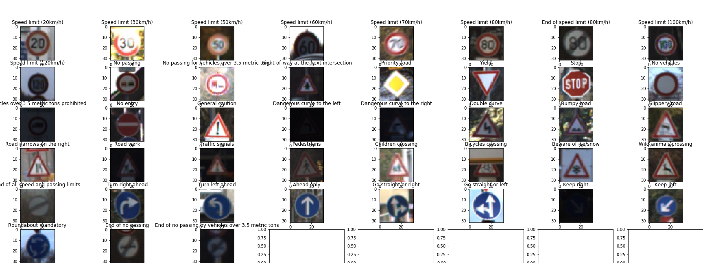
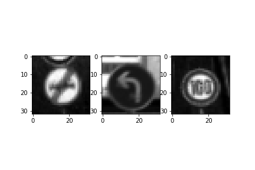
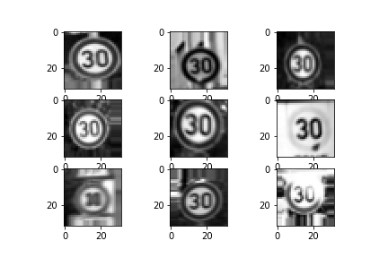
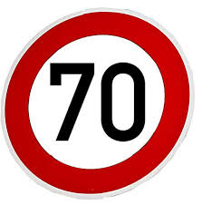
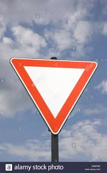
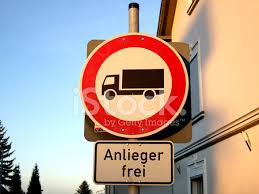

# **Traffic Sign Recognition** 

## Writeup

### You can use this file as a template for your writeup if you want to submit it as a markdown file, but feel free to use some other method and submit a pdf if you prefer.

---

**Build a Traffic Sign Recognition Project**

The goals / steps of this project are the following:
* Load the data set (see below for links to the project data set)
* Explore, summarize and visualize the data set
* Design, train and test a model architecture
* Use the model to make predictions on new images
* Analyze the softmax probabilities of the new images
* Summarize the results with a written report

[//]: # (Image References)

[image1]: ./examples/visualization.jpg "Visualization"
[image2]: ./examples/grayscale.jpg "Grayscaling"
[image3]: ./examples/random_noise.jpg "Random Noise"
[image4]: ./examples/placeholder.png "Traffic Sign 1"
[image5]: ./examples/placeholder.png "Traffic Sign 2"
[image6]: ./examples/placeholder.png "Traffic Sign 3"
[image7]: ./examples/placeholder.png "Traffic Sign 4"
[image8]: ./examples/placeholder.png "Traffic Sign 5"

## Rubric Points
### Here I will consider the [rubric points](https://review.udacity.com/#!/rubrics/481/view) individually and describe how I addressed each point in my implementation.  

---
### Writeup / README

#### 1. Provide a Writeup / README that includes all the rubric points and how you addressed each one. You can submit your writeup as markdown or pdf. You can use this template as a guide for writing the report. The submission includes the project code.

You're reading it! and here is a link to my [project code](https://github.com/udacity/CarND-Traffic-Sign-Classifier-Project/blob/master/Traffic_Sign_Classifier.ipynb)

### Data Set Summary & Exploration

#### 1. Provide a basic summary of the data set. In the code, the analysis should be done using python, numpy and/or pandas methods rather than hardcoding results manually.

I used the numpy library to calculate summary statistics of the traffic signs data set. The code can be seen in the section **Step 1: Data Set Summary & Exploration** from the notebook `Traffic_Sign_Classifier.ipynb`:

* The size of training set is `34799`
* The size of the validation set is `4410`
* The size of test set is `12630`
* The shape of a traffic sign image is `32x32x3`
* The number of unique classes/labels in the data set is `43`

#### 2. Include an exploratory visualization of the dataset.

First, I started plotting an image example for every class to see things like light conditions, blurring and other interesting aspects. Here is the result:

Then, as part of the exploratory visualization of the data set, a bar chart is plotted in order to visualize if the dataset is well balanced, that is, if there are equal number of examples per class. The figure below shows that the dataset is imbalanced:

### Design and Test a Model Architecture

#### 1. Describe how you preprocessed the image data. What techniques were chosen and why did you choose these techniques? Consider including images showing the output of each preprocessing technique. Pre-processing refers to techniques such as converting to grayscale, normalization, etc. (OPTIONAL: As described in the "Stand Out Suggestions" part of the rubric, if you generated additional data for training, describe why you decided to generate additional data, how you generated the data, and provide example images of the additional data. Then describe the characteristics of the augmented training set like number of images in the set, number of images for each class, etc.)

To preprocess the data I did 3 things:
- **Change the image  from RGB to grayscale**: The model showed better accuracy with grayscale images than RGB images. An example of this step is shown below:

- **I use data augmentation because the dataset is imbalanced**: I use a strategy in which if the images per class are fewer than 1000, then I create new data until every class has at least 1000 samples. An example of data augmentation is shown below:

With this technique I ended up with a training set of 54119 images (before augmentation there were 34799 images). The approach to generate data is to create create new images using keras library by shifting horizontal and vertically, width_shift_range and height_shift_range; The shear_range controls the angle in counterclockwise direction as radians in which the image will allowed to be sheared. Finally, the zoom_range, a floating point value that allows the image to be “zoomed in” or “zoomed out” according to the following uniform distribution of values: [1 - zoom_range, 1 + zoom_range]

- **Scale the data to have zero mean and same variance**: I normalized the image data because is easier for the algorithm to optimize the parameters

#### 2. Describe what your final model architecture looks like including model type, layers, layer sizes, connectivity, etc.) Consider including a diagram and/or table describing the final model.

My final model consisted of the following layers:

| Layer         		|     Description	        					| 
|:---------------------:|:---------------------------------------------:| 
| Input         		| 32x32x1 grayscale image   							| 
| Convolution 5x5     	| 1x1 stride, valid padding, outputs 28x28x6 	|
| RELU					|												|
| Max pooling	      	| 2x2 stride,  outputs 14x14x6  				|
| Convolution 5x5	    | 1x1 stride, valid padding, outputs 10x10x16	|
| RELU					|												|
| Max pooling	      	| 2x2 stride,  outputs 5x5x16    				|
| Fully connected		| outputs 120  									|
| RELU					|												|
| Dropout       		| keep_prob: 0.6								|
| Fully connected		| outputs 84  									|
| RELU					|												|
| Dropout       		| keep_prob: 0.6								|
| Fully connected		| outputs 43  									|
| Softmax				| probabilities vector							|

#### 3. Describe how you trained your model. The discussion can include the type of optimizer, the batch size, number of epochs and any hyperparameters such as learning rate.

To train the model, I tuned the algorithm with the following parameters:
- **Optimizer**: Adam optimizer
- **Learning rate**: 0.001
- **Batch size**: 128
- **Number of epochs**: 100

#### 4. Describe the approach taken for finding a solution and getting the validation set accuracy to be at least 0.93. Include in the discussion the results on the training, validation and test sets and where in the code these were calculated. Your approach may have been an iterative process, in which case, outline the steps you took to get to the final solution and why you chose those steps. Perhaps your solution involved an already well known implementation or architecture. In this case, discuss why you think the architecture is suitable for the current problem.

My final model results were:
* training set accuracy of 0.998
* validation set accuracy of 0.961 
* test set accuracy of 0.944

If an iterative approach was chosen:
* What was the first architecture that was tried and why was it chosen. The first architecture was the Lenet presented in the course because it was a good base presented there.
* What were some problems with the initial architecture?. The problem with the architecture was that the accuracy did not get the expected results
* How was the architecture adjusted and why was it adjusted? Typical adjustments could include choosing a different model architecture, adding or taking away layers (pooling, dropout, convolution, etc), using an activation function or changing the activation function. One common justification for adjusting an architecture would be due to overfitting or underfitting. A high accuracy on the training set but low accuracy on the validation set indicates over fitting; a low accuracy on both sets indicates under fitting. The first thing I did was to change the optimization algorithm to `Adam Optimizer`. I made this decision because this optimizer is more robust than Gradient Descent. Next, I wanted to see of the model could be improved by feeding in it grayscale images instead of RGB images and indeed, the model accuracy was improved. Then I trained the model and realized an overfitting problem, where the training accuracy was high but the validation accuracy low. In that point I decided to use regularization techniques such as Dropout (in fully connected layers) and L2 regularization as well as use data augmentation techniques to reduce overfitting. The gap between train and validation accuracy was reduced by these techniques but at a cost: train and validation accuracy were almost the same, 92% and it was difficult to get a better performance with a beta value for L2 regularization of 0.01. So after data augmentation which improved performance I decided to train only with either L2 regularion or Dropout and I found that the model only with Dropout has a good accuracy on both training and validation (0.99 and 0.96 respectively)
* Which parameters were tuned? How were they adjusted and why?. I tuned the `learning_rate` as well as the `dropout`. I found that the better value for learning rate that made possible the convergence of the algorithm was `0.001`. I tried with values `0.1, 0.01, 0.5 and 0.0001`. I also tuned the `keep_prob` hyperparameter with values ranging `from 0.5 to 0.8`. I found that the best value was `0.6`.
* What are some of the important design choices and why were they chosen? For example, why might a convolution layer work well with this problem? How might a dropout layer help with creating a successful model?. This kind of model is important because translation invariance, where the traffic sign can appear in different positions in the image. Other important thing is that the model learn to recognize shapes despite of light conditions. Regularization techniques are useful because they reduce overfitting and made the model to generalize better to new data. Also by generating fake data, the algorithm gets a better performance

If a well known architecture was chosen:
* What architecture was chosen. The LENET architeture proposed in course was chosen
* Why did you believe it would be relevant to the traffic sign application?. It is relevant because the model learn to recognize traffic signs with high confidence
* How does the final model's accuracy on the training, validation and test set provide evidence that the model is working well?. There is evidence that the model performs well because the gap between training, validation and test accuracy is low

### Test a Model on New Images

#### 1. Choose five German traffic signs found on the web and provide them in the report. For each image, discuss what quality or qualities might be difficult to classify.

Here are five German traffic signs that I found on the web:

   
 

The second image is difficult to classify because the traffic sign is not the main object inside the image. In the training data, I saw that that the traffic sign is the main object in the image. Also there are other objects like the sky, road and trees that make the classification task difficult

#### 2. Discuss the model's predictions on these new traffic signs and compare the results to predicting on the test set. At a minimum, discuss what the predictions were, the accuracy on these new predictions, and compare the accuracy to the accuracy on the test set (OPTIONAL: Discuss the results in more detail as described in the "Stand Out Suggestions" part of the rubric).

Here are the results of the prediction:

| Image			        |     Prediction	        					| 
|:---------------------:|:---------------------------------------------:| 
| 70km/h        		| 70km/h    									| 
| 70km/h     			| Dangerous curve to the left					|
| No entry				| No entry										|
| Yield	        		| Yield					 				|
| Vehicles over 3.5 metric tons prohibited			| Vehicles over 3.5 metric tons prohibited      							|

The accuracy on this test images is 80%, 4 out of 5 images were classified correctly. The second image was misclassified and as can be seen, the image is difficult a different from others. Maybe cropping the image and select only the region that has the traffic sign could solve the issue or maybe training with more images like this one could make the model more robust. The model was expected to have a good accuracy given the result on the validation as well as the test set

#### 3. Describe how certain the model is when predicting on each of the five new images by looking at the softmax probabilities for each prediction. Provide the top 5 softmax probabilities for each image along with the sign type of each probability. (OPTIONAL: as described in the "Stand Out Suggestions" part of the rubric, visualizations can also be provided such as bar charts)

The code for making predictions on my final model is located in the section **Output Top 5 Softmax Probabilities For Each Image Found on the Web** of the Ipython notebook.

For the first image, the model is sure that this is a 70km/h (probability of 1.0), and the image does contain a 70km/h sign. The top five soft max probabilities were:

| Probability         	|     Prediction	        					| 
|:---------------------:|:---------------------------------------------:| 
| 1.00         			| 70km/h   									| 
| 4.9569060e-20 		| 30km/h										|
| 2.2015546e-26			| 20km/h											|
| 1.3935065e-34			| Dangerous curve to the left	 				|
| 6.8899646e-36		    | 120km/h      							|

For the second image, the model is sure that this is a Dangerous curve to the left (probability of 0.9), but the image does contain a 70km/h sign. In this case the model misclassified the image. The top five soft max probabilities were:

| Probability         	|     Prediction	        					| 
|:---------------------:|:---------------------------------------------:| 
| 9.8192155e-01        	| Dangerous curve to the left					| 
| 1.7920591e-02 		| Double curve									|
| 1.2478702e-04			| Go straight or left							|
| 1.3720754e-05			| Traffic signals	 		            		|
| 1.2358522e-05		    | Pedestrians      						    	|

For the third image, the model is sure that this is a No entry (probability of 1.0), and the image does contain a No entry sign. The top five soft max probabilities were:

| Probability         	|     Prediction	        					| 
|:---------------------:|:---------------------------------------------:| 
| 1.0000000e+00			| No entry   									| 
| 2.7418202e-21 		| Turn left ahead										|
| 9.8043460e-22			| End of no passing by vehicles over 3.5 metric tons	|
| 2.0370337e-22			| Turn right ahead	 				|
| 6.0528269e-23		    | End of no passing      							|

For the fourth image, the model is sure that this is a Yield (probability of 1.0), and the image does contain a Yield sign. The top five soft max probabilities were:

| Probability         	|     Prediction	        					| 
|:---------------------:|:---------------------------------------------:| 
| 1.0000000e+00			| Yield   									| 
| 3.6486094e-22 		| No vehicles										|
| 2.5744921e-22			| Stop            	|
| 8.8634232e-25			| End of all speed and passing limits	 				|
| 7.7069058e-25		    | 30km/h      							|

For the fifth image, the model is sure that this is a `Vehicles over 3.5 metric tons prohibited` (probability of 0.99), and the image does contain a `Vehicles over 3.5 metric tons prohibited` sign. The top five soft max probabilities were:

| Probability         	|     Prediction	        					| 
|:---------------------:|:---------------------------------------------:| 
| 9.9995208e-01			| Vehicles over 3.5 metric tons prohibited   									| 
| 4.2835971e-05 		| End of no passing by vehicles over 3.5 metric tons							|
| 2.7159281e-06			| Right-of-way at the next intersection            	|
| 2.3204302e-06			| Turn left ahead	 				|
| 5.3795528e-08		    | Turn right ahead      							|
        

        
        